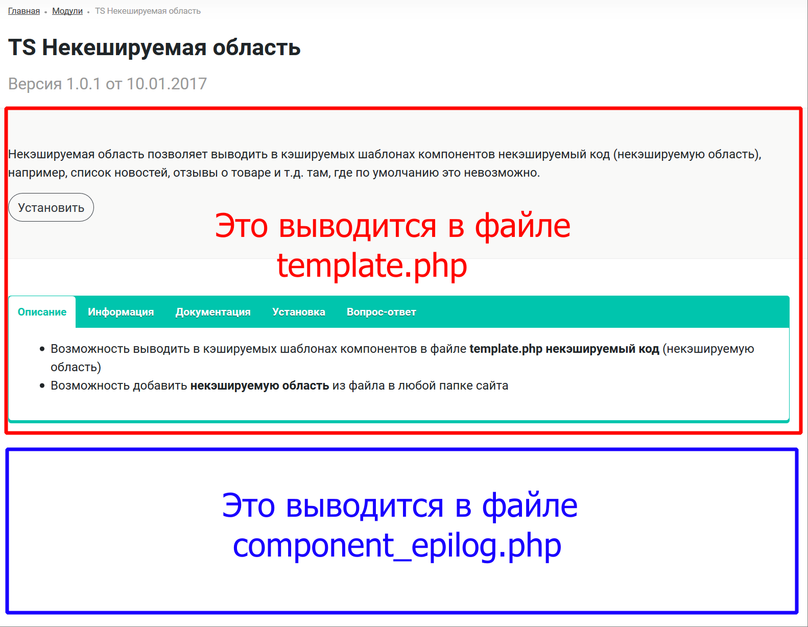

# api.uncachedarea
## TS Некешируемая область (api.uncachedarea)
   Некэшируемая область позволяет выводить в кэшируемых шаблонах компонентов некэшируемый код (некэшируемую область), например, список новостей, отзывы о товаре и т.д. там, где по умолчанию это невозможно.
   
*   Возможность выводить в кэшируемых шаблонах компонентов в файле template.php некэшируемый код (некэшируемую область)
*   Возможность добавить некэшируемую область из файла в любой папке сайта


Модуль предназначен для вывода динамических данных, например список новостей, список отзывов, любые формы и т.д. в кэшируемых шаблонах компонентов.

**template.php и result_modifier.php**

Шаблон любого компонента в 1С Битрикс состоит из двух кэшируемых файлов `template.php` и `result_modifier.php`, оба файла "кэшируются", скажем грубо, в готовый html и выводятся данные без запросов к базе.

result_modifier.php - данный файл предназначен для какой-нибудь дополнительной логики, которая будет изменять или дополнять $arResult в шаблоне template.php
template.php - основной файл шаблона компонента, в котором выводится весь html-код, вот здесь вас чаще всего ждут проблемы с выводом динамических данных.

**component_epilog.php**

Еще существует в шаблоне третий файл component_epilog.php, единственный файл который "не кэшируется", он выполняется на каждом хите, подключается после шаблона, его нужно создавать вручную, автоматически он не создается.

Вот в данном файле часто разработчики и выводят динамические данные, чтобы не кэшировались, если позволяет дизайн страницы, получается данный файл выводит какой-то контент в самом низу, что многим по дизайну это не подходит.




Часто можно встретить к примеру отзывы в самом низу страницы, это удобно и просто, но как быть, когда отзывы о магазине или комментарии к товару нужно сделать в табах, вот как у меня на примере Вопрос-ответ сделаны.

Данный модуль и решает данную задачу, в любом месте шаблона template.php можно вывести что угодно и оно не будет кэшироваться, область будет работать равносильно файлу component_epilog.php и там где нам нужно.

### Краткая инструкция

В целом ничего сложно, по сути всего два телодвижения:

1) В шаблоне template.php  нужно вставить вызов компонента некешируемой области, указать в нем путь до произвольного php-файла и передать параметры элемента.

2) Создать произвольный php-файл и вставить в нем код вызова нужного вам компонента, например Отзывы, Комментарии, Новости, а в глобальном массиве $arParams этого файла будут доступны все переданные ему параметры элемента, их нужно подставлять в ваш компонент Отзывов или что там будет, без разницы, обычно всякие айдишники товара передаются и название товара, для привязки отзывов или комментариев к товару.

### Подробная инструкция

**Шаблон компонента**

В шаблоне компонента в файле template.php в нужном месте дизайна/верстки вставьте подобный код вызова компонента

```php
<?
if(
   Bitrix\Main\Loader::includeModule('api.uncachedarea')
   && Bitrix\Main\Loader::includeModule('api.reviews')
) {
  CAPIUncachedArea::includeFile(
     "/include/api_reviews.php",
     array(
        'ID'   => $arResult['ID'],
        'NAME' => $arResult['NAME'],
     )
  );
}

```

Разберем, что передается в компонент, всего два параметра, вообще, это метод класса = код вызова компонента:

`CAPIUncachedArea::includeFile($rel_path, $arParams);`

$rel_path - путь до произвольного php-файла относительно корня сайта, в который будут передаваться параметры из $arParams, в нашем случае это файл /include/api_reviews.php

$arParams - массив любых параметров, которые передаются в произвольный php-файл, в произвольном php-файле параметры будут доступны в массиве $arParams

**Произвольный PHP-файл**

Создаем на сайте произвольный php-файл, например /include/api_reviews.php, можно вообще любой, вот его пример:

```php
<?
/** @var array $arParams */

if(!defined("B_PROLOG_INCLUDED") || B_PROLOG_INCLUDED !== true)
  die();
?>
<? $APPLICATION->IncludeComponent(
   "api:reviews",
   ".default",
   array(
      "FORM_SHOP_BTN_TEXT"               => "Добавить отзыв",
      "FORM_SHOP_TEXT"                   => $arParams["NAME"] . " отзывы",
      "INCLUDE_CSS"                      => "Y",
      "PAGER_TITLE"                      => "Отзывы",
      "SHOP_NAME"                        => $arParams["NAME"],
      "PICTURE"                          => array(),
      "ELEMENT_ID"                       => $arParams["ID"],
      "ORDER_ID"                         => "",
      "SEF_MODE"                         => "N",
      "SET_STATUS_404"                   => "N",
      "SHOW_404"                         => "N",
      "MESSAGE_404"                      => "",
      "PAGER_THEME"                      => "blue",
      "COLOR"                            => "blue1",
      "FORM_FORM_SUBTITLE"               => $arParams["NAME"],
      "USE_FORM_MESS_FIELD_PLACEHOLDER"  => "N",
      "VARIABLE_ALIASES"                 => array(
         "review_id" => "review_id",
         "user_id"   => "user_id",
      ),
   ),
   false
); ?>
```

Ну и все на этом, далее только подставляем из $arParams куда что нужно, даже при включенном кеше компонент из этого файла будет выводиться и работать, все подключаемые в нем динамически скрипты, стили и т.д. все будут работать, т.к. данная область не будет кэшироваться, она можно сказать динамически выводится вне кэша.

**Возможные проблемы**

_"Все сделал по инструкции, ничего не работает"..._

Попробуйте сбросить весь кэш в админке, может композит включен, с композитом модуль не работает, проверьтесь еще раз, много раз, не допустили где ошибку, банальный ляп от усталости...